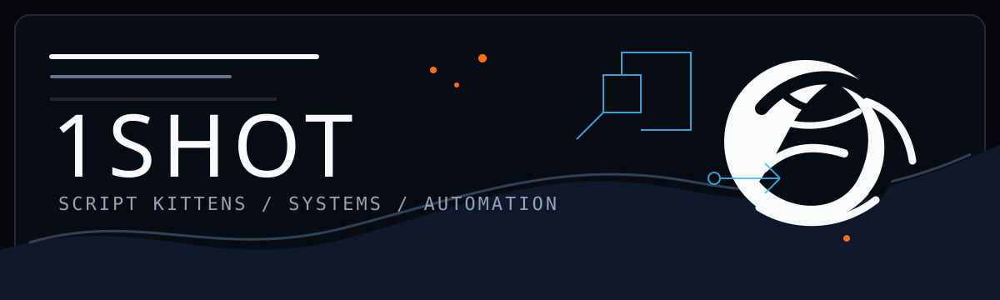
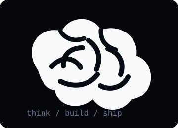
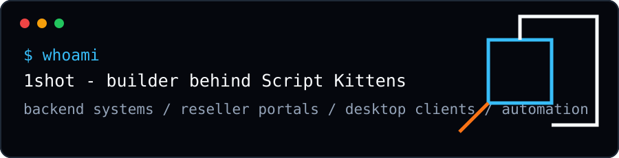
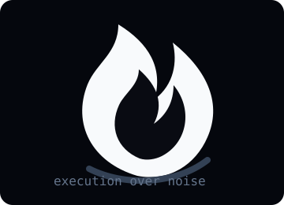

<div align="center">



<br/>


<br/>
<br/>

[](https://github.com/1shot-1moan)

</div>

---

<div align="center">

## Know About Me

</div>

<table>
<tr>
<td width="36%" align="center">
  
</td>
<td width="64%">

Hey, I am **1shot**, the builder behind **Script Kittens**.

I build practical software: backend systems, reseller portals, desktop clients, Discord automation, authorization flows, update systems, and management panels that are meant to be used by real people.

```text
make it usable
make it controllable
make it reliable enough to sell
```

The main focus is simple: build tools that can be shipped, managed, updated, and trusted without turning every small change into a full rebuild.

</td>
</tr>
</table>

---

<div align="center">



</div>

---

<div align="center">

## Top Projects

</div>

<table>
<tr>
<td width="50%">

### UID Bypass EXE

Windows desktop client with authorization, backend sync, Discord RPC, DLL updates, reseller branding, and a clean base EXE flow.

```text
C++17 / Win32 / DirectX 11 / ImGui
server-managed updates
reseller authorization
```

[](https://github.com/1shot-1moan/UID-Bypass-Exe)

</td>
<td width="50%">

### Onyx Gate Auth

Authorization layer for keys, HWID locks, plan gates, sessions, and controlled software access.

```text
license keys
device locking
live backend validation
```

[](https://auth.script-kittens.com)

</td>
</tr>
<tr>
<td width="50%">

### Script Kittens Bot

Discord automation for community operations, product delivery, support flows, and management tasks.

```text
Discord automation
community tooling
backend integrations
```

[](https://discord.gg/tWwUSPh5GT)

</td>
<td width="50%">

### Reseller Systems

Portal-driven client management with codes, owner branding, remote sync, and update delivery.

```text
reseller control
client authorization
branding sync
```

[](https://script-kittens.com)

</td>
</tr>
</table>

---

<table>
<tr>
<td width="64%">

## Stack


<br/>
<br/>


</td>
<td width="36%" align="center">
  
</td>
</tr>
</table>

---

<div align="center">

## Connect

[](https://discord.gg/tWwUSPh5GT)
[](https://www.youtube.com/@1shot1moanz)
[](https://www.instagram.com/fegrial)
[](mailto:alfurqanimran@gmail.com)

<br/>
<br/>

> Code is not finished when it compiles. It is finished when users can run it, update it, and trust the flow.

</div>

---

<div align="center">

## Contribution


<br/>
<br/>


</div>
